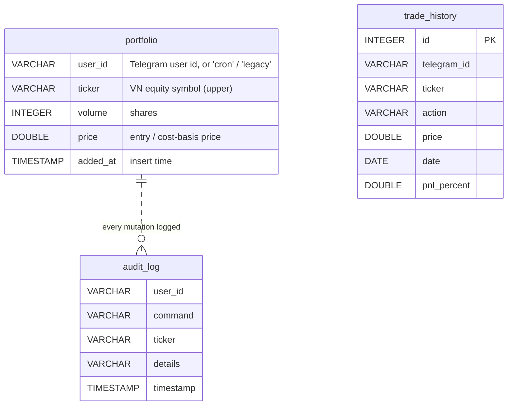
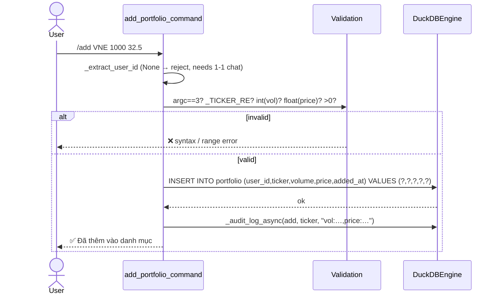
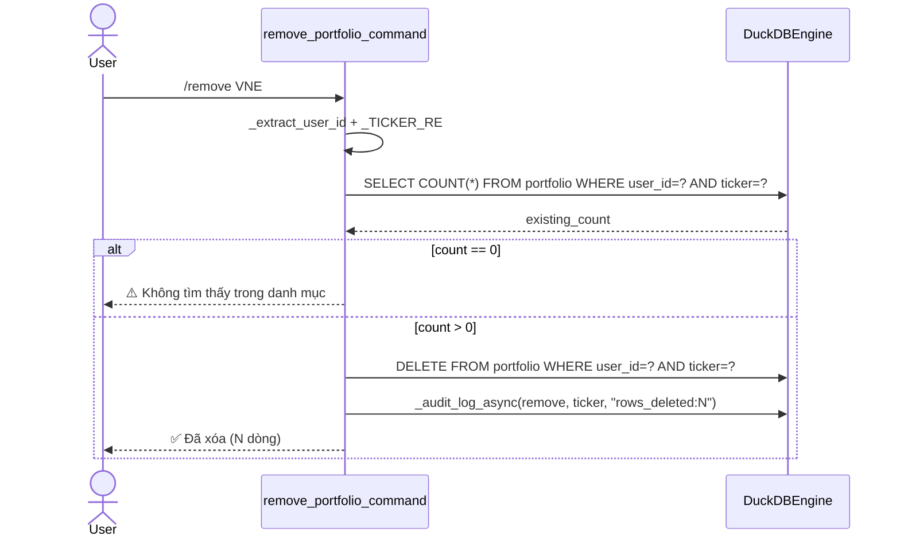
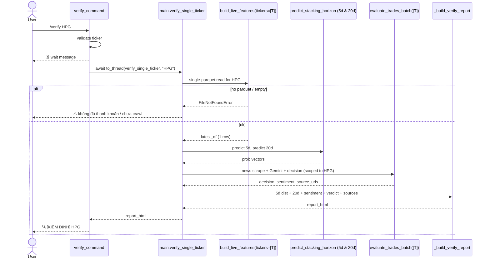

# Portfolio CRUD — `/add`, `/remove`, `/verify`

**Table:** `portfolio (user_id VARCHAR, ticker VARCHAR, volume INTEGER, price DOUBLE, added_at TIMESTAMP)`
**Isolation:** every row is tagged with the Telegram `user_id`; all reads/writes filter on it.
**SQL:** 100% parameterized (`?` placeholders) — injection-safe.

## Table schema & ownership

> **Migration note:** `_init_portfolio_table` detects a legacy single-user
> schema and `ALTER TABLE … ADD COLUMN user_id`, tagging old rows
> `user_id='legacy'` so they never surface in a real user's queries.
> Automated cron positions use `user_id='cron'` (`PortfolioManager`).

## `/add <ticker> <volume:int> <price:float>`

Pure INSERT — **no dedup, no upsert.** Repeated `/add VNM …` creates
multiple rows; downstream consumers (`/rebalance`, `PortfolioManager`)
dedup on read.

## `/remove <ticker>`

Count-then-delete so the user gets a meaningful "not found" vs.
"deleted N rows" reply. Deletes **all** lots of that ticker for the user.

## `/verify <ticker>` — ad-hoc single-ticker analysis

`/verify` is **read-only** w.r.t. `portfolio` — it does **not** touch the
table. It is a rumor/news fact-check: run 5d + 20d Stacking GBDT plus the
LLM arbitrator on one symbol and return a combined verdict.

## Cross-cutting

- **Audit:** every mutating command writes to `audit_log` via
  `_audit_log_async` (best-effort, never blocks the user reply).
- **Group chats:** `_extract_user_id` returns `None` → `/add` / `/remove`
  refuse (require 1-1 DM) so portfolios can't be polluted by a shared id.
- **`PortfolioManager` (cron)** shares the same table with
  `user_id='cron'`; it additionally enforces stop-loss
  (`-7%`) / take-profit (`+15%`) — logic that the bot CRUD path does
  **not** apply.
