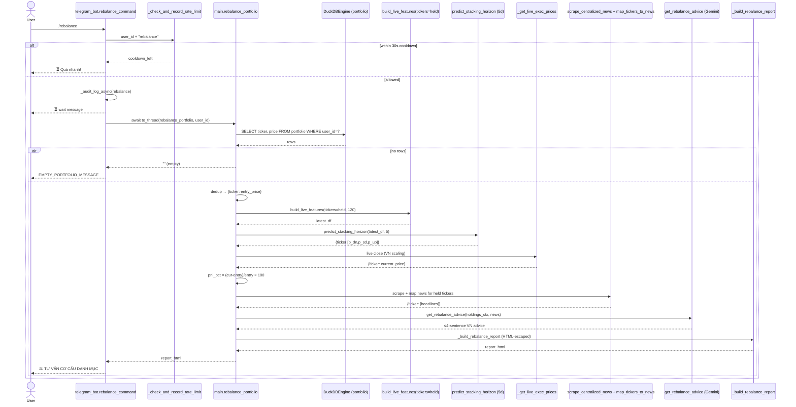

# `/rebalance` — AI Portfolio Rebalancing Advisor

**Entry point:** `telegram_bot.rebalance_command` → `main.rebalance_portfolio(user_id)`
**Storage:** `portfolio` table, filtered by `user_id`
**LLM:** `quant_agent_arbitrator.get_rebalance_advice` (Gemini, ≤4 Vietnamese sentences)
**Heavy work runs in:** `asyncio.to_thread`; protected by the 30s rate limiter

## Summary

The only command that combines **cost basis (PnL)** + **model forecast** +
**news** into a single LLM-authored portfolio action. Reads `(ticker, price)`
for the user's holdings, computes per-ticker unrealized PnL against the live
price, runs the **5d** Stacking GBDT, scrapes news for the held names, and
asks Gemini for a concrete rebalance recommendation (hold / take-profit /
cut-loss / rotate capital).

## Sequence



## `holdings_context` payload to the LLM

Per held ticker, the prompt receives:

```text
ticker      : str
pnl_pct     : (current_price - entry_price) / entry_price * 100   # 0 if entry<=0
pred_label  : 🔴 Giảm | 🟡 Đi ngang | 🟢 Tăng   (argmax of 5d probs)
p_up        : float (5d UP probability)
```

`REBALANCE_SYSTEM_PROMPT` instructs Gemini to act as a Quant Portfolio
Manager and return ≤4 Vietnamese sentences, no markdown,
`temperature=0.2`. Missing API key → graceful fallback string.

## Notes / risks

- **5d only.** Unlike `/suggest_buy`/`/suggest_sell`, `/rebalance` runs a
  single horizon (5d). It does not pass a 20d view to the LLM, so the
  advice has no medium-term anchor.
- PnL uses the **stored entry `price`** vs. **live close** — it ignores
  fees, partial fills, and multiple lots (dedup keeps the last `price`).
- The LLM output is **free-text advice, not an executable order** — no
  `portfolio` write happens. `/rebalance` is advisory only.
