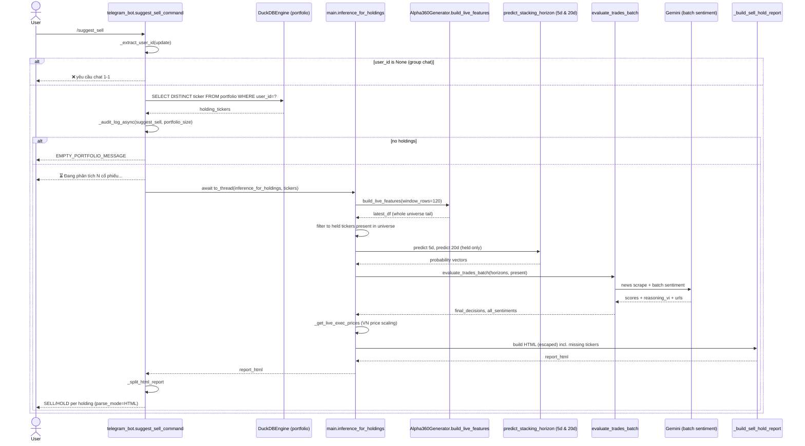

# `/suggest_sell` — Holdings SELL/HOLD Recommendation

**Entry point:** `telegram_bot.suggest_sell_command` → `main.inference_for_holdings`
**Storage:** `portfolio` table, **filtered by `user_id`** (multi-user safe)
**Heavy work runs in:** `asyncio.to_thread`

## Summary

Reads **this user's** holdings from the `portfolio` table, runs dual-horizon
Stacking GBDT + the LLM arbitrator on those tickers only, and returns a
BÁN (SELL) / GIỮ (HOLD) recommendation per holding. Unlike `/suggest_buy`,
it **skips the liquidity gate and the Top-6/Top-3 funnel** — every holding
gets a verdict. Tickers absent from the live feature universe (delisted /
not crawled) are reported as warnings.

## Sequence

## Decision mapping

The same `make_final_decision` dual-horizon veto runs as in `/suggest_buy`
(see [`cmd_suggest_buy.md`](cmd_suggest_buy.md)). For holdings the integer
verdict is rendered as:

| `decision` | Holdings meaning |
|------------|------------------|
| `0` | 🔴 BÁN (SELL) — full exit |
| `1` | 🟡 GIỮ (HOLD) — veto / neutral |
| `2` | 🟢 GIỮ / MUA THÊM (strong hold) |

## Notes / risks

- **Decoupled from entry price.** `/suggest_sell` is a *signal* view; it
  does **not** read the user's `price` (cost basis) and therefore ignores
  realized/unrealized PnL, stop-loss, and take-profit. Risk exits live only
  in `PortfolioManager.update_live_performance` (cron path), not here.
- Holdings missing from the live universe are surfaced as a warning block —
  they are silently skipped by the model, not failed.
- No liquidity gate: an illiquid holding still gets a (low-confidence)
  model verdict.
