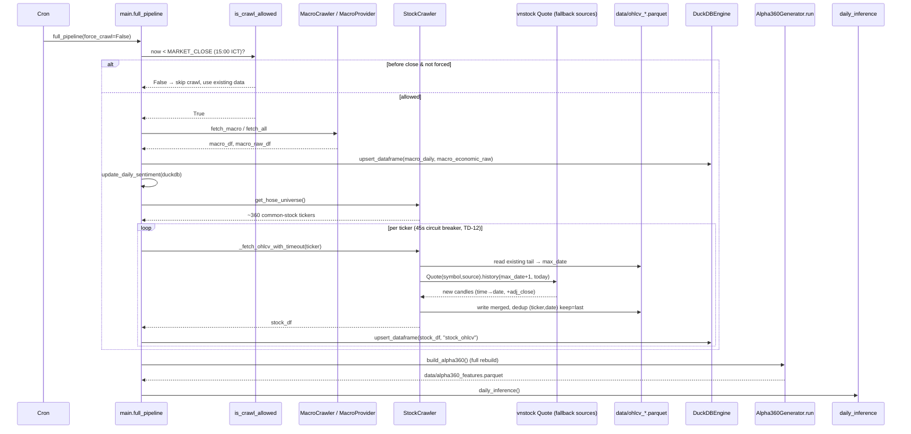
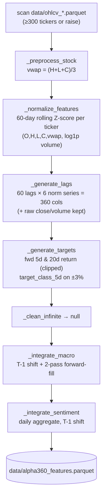

# Data Pipeline — OHLCV Crawl → Parquet → DuckDB → Alpha360

**Crawler:** `src/data/crawlers.py` (`StockCrawler`, `MacroCrawler`, `MacroProvider`)
**Store:** per-ticker Parquet `data/ohlcv_<TICKER>.parquet` + DuckDB `data/quant_v6_core.duckdb`
**Features:** `src/features/alpha360_generator.py` → `data/alpha360_features.parquet`
**Orchestrators:** `main.full_pipeline` (full) and `main.crawl_hose` (crawl-only)

## ⚠ Two write targets — the staleness foot-gun

There are **two** parallel stores and they are **not** updated by the same
code path:

| Path | Writes Parquet? | Writes DuckDB `stock_ohlcv`? |
|------|-----------------|------------------------------|
| `crawl_hose` → `crawl_hose_overnight` | ✅ yes | ❌ **NO** |
| `full_pipeline` (crawl loop) | ✅ yes (`fetch_ohlcv`) | ✅ yes (`upsert_dataframe`) |

`Alpha360Generator.run()` and `build_live_features()` read **Parquet** for
OHLCV, but macro/sentiment from **DuckDB**. So a `crawl_hose`-only schedule
keeps Parquet (and therefore inference) current while `stock_ohlcv` in
DuckDB silently drifts stale. This is the root cause of the May-2026
7-day staleness incident; any data-integrity job must verify **both**
stores, and a corrupted Parquet poisons inference even when DuckDB is fixed
(recovery requires re-fetching from the live vnstock API, bypassing
Parquet).

## Nightly full pipeline

### Crawl guard (`is_crawl_allowed`)

- Skips the crawl when VN local time `< MARKET_CLOSE` (15:00 ICT) so
  inference never trains on a half-formed intraday bar.
- `force_crawl=True` bypasses the guard for operator rebuilds.

### Incremental fetch (`StockCrawler.fetch_ohlcv`)

- Reads the existing Parquet, takes `max(date)`, fetches **only**
  `max_date + 1 … today`.
- Iterates `self.fallback_sources` (e.g. VCI → …); first non-empty wins.
- Normalizes `time|tradingDate → date`, injects `adj_close = close` if
  absent, requires `[ticker,date,open,high,low,close,volume,adj_close]`.
- Merges old+new, `drop_duplicates(["ticker","date"], keep="last")`,
  sorts, rewrites the full Parquet file.

## Alpha360 feature build

- **Live path** (`build_live_features`): same transforms but only a
  `window_rows`-tail per ticker, **no target generation**, returns the
  single latest row per ticker for inference.
- **Leak control:** macro & sentiment are shifted by **T-1** before the
  join; the trainer additionally drops `raw_close/close/target_*` from the
  feature matrix (`LEAKAGE_COLS`).

## Macro frequency handling

- Daily series (DXY, S&P 500, USD/VND, interbank, vnibor): forward-filled
  across non-VN-trading gaps.
- Monthly series (`inflation_yoy`, CPI YoY): forward-filled "as-of" from
  release date through every subsequent business day.
- Macro values are passed through **raw** (not Z-scored) — levels carry
  the policy-regime signal.

## DuckDB engine

- `DuckDBEngine` is a **process singleton** (one read-write connection;
  `read_only=`/`config=` are forbidden — mixed configs crash DuckDB).
- `upsert_dataframe` → `INSERT OR REPLACE INTO {table} BY NAME SELECT * FROM df`
  resolving on the table's PRIMARY KEY.
  - ⚠ `{table_name}` is f-string-interpolated (caller-controlled only) —
    tracked as tech-debt **TD-B** (add an allowlist).
- `stock_ohlcv` PK = `(ticker, date)`; idempotent re-runs are safe.

## Operational risks

| Risk | Detail |
|------|--------|
| Parquet/DuckDB divergence | `crawl_hose` never upserts DuckDB (see top). |
| Corrupted Parquet | Poisons inference; only fix is live-API re-fetch + verify a known close before write. |
| Source drift | vnstock fallback source list is the single point of failure; an invalid source name silently `continue`s. |
| Rate limits | 429 → hard cooldown sleep; large universes need throttling. |
| No supervisor / backup | Tracked as tech-debt TD-C / TD-D. |
